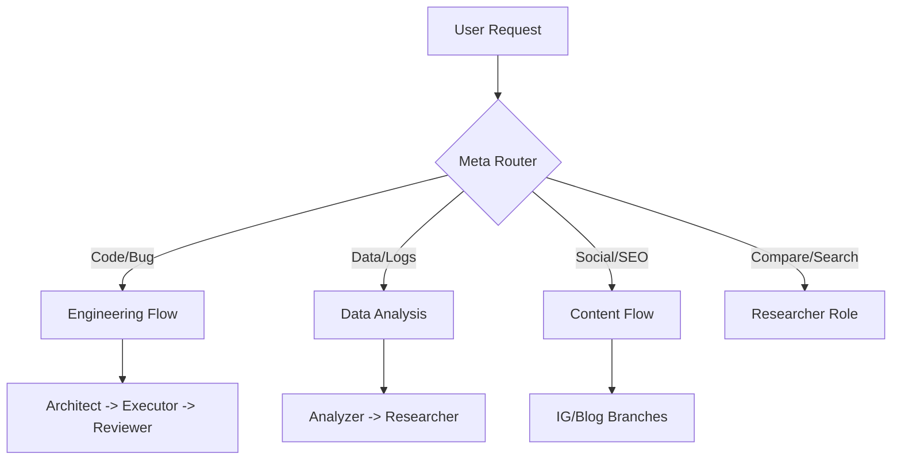

# Personal AI OS v2.2 (Stability & Performance)

## 🎯 Value Proposition

A highly modular, platform-agnostic AI agent framework. It forces the LLM to adopt specific **Workflows**, **Roles**, and **Skills**, significantly reducing cost and increasing output consistency.

## 🚀 Quick Start (3-Min Setup)

1. **Clone & Explore**: Check out the `.agent/` directory.
2. **Deploy**: Run `./deploy_brain.sh <your_project_path>` to install the brain.
3. **Configure**: Update `.agent/99_memory.md` with your tech stack.
4. **Agent Setup**:
   - Paste `SYSTEM_INSTRUCTION.txt` into your AI's system prompt (IDX, Claude, etc.).

### 📖 Usage Scenario: Bug Hunting
>
> **User**: "My login API is failing with a 500 error."
> **AI OS Logic**:
>
> 1. Router detects `error/fail`.
> 2. Loads `workflows/bug_investigation.md`.
> 3. Role: **Analyzer** parses your logs.
> 4. Role: **Architect** proposes a fix.
> 5. Role: **Executor** writes the code.

## 🏗️ Structure Guide

- **Rules (`.agent/rules/`)**: Behavioral instructions (How to search, how to analyze). *Use for standardized tasks.*
- **Roles (`.agent/roles/`)**: Personality & thinking style (Critical, Creative, Precise). *Use for open-ended decision making.*
- **Workflows (`.agent/workflows/`)**: Step-by-step processes for complex missions.

### Directory Tree

```text
.agent/
├── 00_meta_router.md       # Decision tree & Token/Model Strategy
├── 99_memory.md            # Persistent User Context
├── rules/                  # NEW: Task-specific "How-to" (Research, Analysis)
├── workflows/              # Process Logic (Engineering, Bug, Content, Data)
├── roles/                  # Task Personas (Architect, Executor, etc.)
└── skills/                 # Capability Templates
```

## ⚖️ Model Intelligence Strategy

To save costs on Google Antigravity / Claude:

- **Flash Logic**: Automatically triggered for simple code edits and unit tests.
- **Pro Logic**: Triggered for multi-file refactors and root-cause analysis.
- **Goal**: Minimize context overhead by only loading required role/skill files.

## 🗺️ Decision Routing Flow



## 🛠️ Platform Support

- **Google IDX / Antigravity**: Use `SYSTEM_INSTRUCTION.txt`.
- **Cursor**: `.cursorrules` (Auto-loaded).
- **Claude.ai**: Upload `.agent/` and use instructions.
- **VS Code**: Install AI extensions and point to `.agent/00_meta_router.md`.
